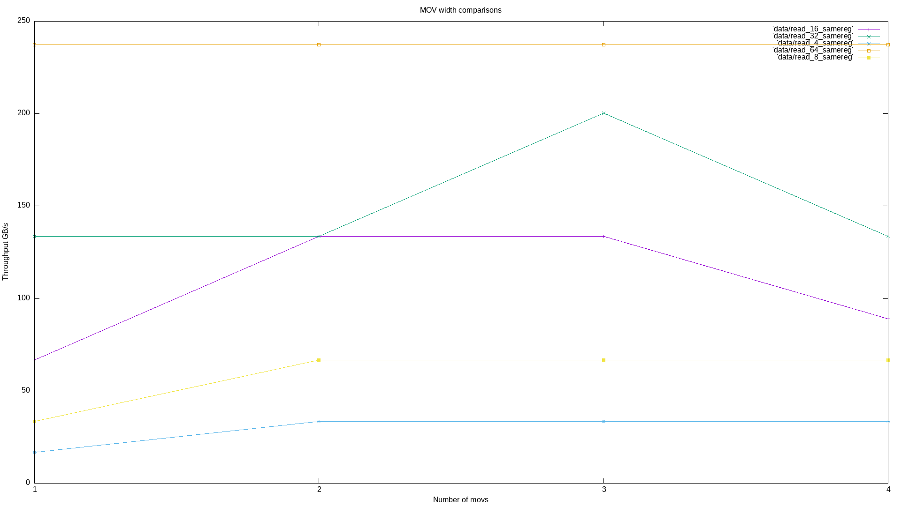

# MOV read width bandwidths

This repository benchmarks the bandwidth of reading memory via `mov` or `vmovdqu` for 
a variety of register widths.

* `src/lib.rs` contains all of the benchmark functions
* `src/main.rs` contains the benchmark runner

## Usage

Execute the test:

```
cargo run -r
```

View results:

<details>
    <summary>Resulting data</summary>
````
----- "read_4_sameregx1" -----
Min: 234304501 (59.89ms )    16.70 GB/sec | PageFaults: 0
Max: 235764624 (59.94ms )    16.68 GB/sec | PageFaults: 0
Avg: 234472071 (59.94ms )    16.68 GB/sec | PageFaults: 0
----- "read_4_sameregx2" -----
Min: 117174049 (29.95ms )    33.39 GB/sec | PageFaults: 0
Max: 120529801 (30.00ms )    33.33 GB/sec | PageFaults: 0
Avg: 117377385 (30.00ms )    33.33 GB/sec | PageFaults: 0
----- "read_8_sameregx1" -----
Min: 117137369 (29.94ms )    33.40 GB/sec | PageFaults: 0
Max: 120409889 (30.00ms )    33.34 GB/sec | PageFaults: 0
Avg: 117348086 (30.00ms )    33.34 GB/sec | PageFaults: 0
----- "read_8_sameregx2" -----
Min: 58578168 (14.97ms )    66.78 GB/sec | PageFaults: 0
Max: 63689656 (15.09ms )    66.28 GB/sec | PageFaults: 0
Avg: 59021242 (15.09ms )    66.28 GB/sec | PageFaults: 0
----- "read_16_sameregx1" -----
Min: 58572119 (14.97ms )    66.79 GB/sec | PageFaults: 0
Max: 61516180 (14.99ms )    66.73 GB/sec | PageFaults: 0
Avg: 58625575 (14.99ms )    66.73 GB/sec | PageFaults: 0
----- "read_16_sameregx2" -----
Min: 29287250 (7.49ms  )   133.57 GB/sec | PageFaults: 0
Max: 29535505 (7.49ms  )   133.50 GB/sec | PageFaults: 0
Avg: 29303127 (7.49ms  )   133.50 GB/sec | PageFaults: 0
----- "read_32_sameregx1" -----
Min: 29288643 (7.49ms  )   133.57 GB/sec | PageFaults: 0
Max: 29374510 (7.49ms  )   133.51 GB/sec | PageFaults: 0
Avg: 29301682 (7.49ms  )   133.51 GB/sec | PageFaults: 0
----- "read_32_sameregx2" -----
Min: 29288468 (7.49ms  )   133.57 GB/sec | PageFaults: 0
Max: 29332951 (7.49ms  )   133.51 GB/sec | PageFaults: 0
Avg: 29300062 (7.49ms  )   133.51 GB/sec | PageFaults: 0
----- "read_32_sameregx3" -----
Min: 19529432 (4.99ms  )   200.31 GB/sec | PageFaults: 0
Max: 19613931 (4.99ms  )   200.23 GB/sec | PageFaults: 0
Avg: 19537386 (4.99ms  )   200.23 GB/sec | PageFaults: 0
----- "read_64_sameregx1" -----
Min: 16482355 (4.21ms  )   237.34 GB/sec | PageFaults: 0
Max: 17320830 (4.26ms  )   234.61 GB/sec | PageFaults: 0
Avg: 16674513 (4.26ms  )   234.61 GB/sec | PageFaults: 0
----- "read_64_sameregx2" -----
Min: 16482267 (4.21ms  )   237.35 GB/sec | PageFaults: 0
Max: 17036931 (4.26ms  )   234.92 GB/sec | PageFaults: 0
Avg: 16652719 (4.26ms  )   234.92 GB/sec | PageFaults: 0
----- "read_64_sameregx3" -----
Min: 16482282 (4.21ms  )   237.35 GB/sec | PageFaults: 0
Max: 17456147 (4.26ms  )   234.68 GB/sec | PageFaults: 0
Avg: 16669712 (4.26ms  )   234.68 GB/sec | PageFaults: 0
```
</detail>

````
xdg-open data.png
```

## Results

These results were ran on the following machine:

`Intel(R) Xeon(R) W-2245 CPU @ 3.90GHz`



## Example benchmark function

This example tests `4` reads of with width `64 bytes` (using AVX512) using 4 different read registers.

```rust
pub fn read_64_diffregx4(buffer: &[u8]) {
    unsafe {
        asm!(
            r#"
            xor rax, rax
            .align 64
        2:
            vmovdqu32 zmm0, [{buffer}]
            vmovdqu32 zmm1, [{buffer} + 64]
            vmovdqu32 zmm2, [{buffer} + 128]
            vmovdqu32 zmm3, [{buffer} + 192]
            add rax, 256
            cmp rax, {count}
            jb 2b
        "#,
            buffer = in(reg) buffer.as_ptr(),
            count = in(reg) buffer.len(),
            options(nostack),
        );
    }
}
```
