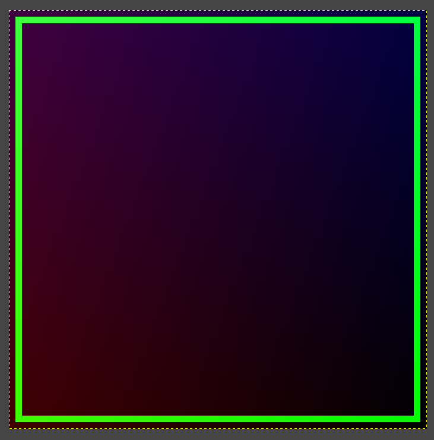

# 8086 Emulator

The current emulator will execute a given program. For example, to execute the draw rectangle programs
from the course

```
git clone https://github.com/cmuratori/computer_enhance
cargo run -r -- ./computer_enhance/perfaware/part1/listing_0055_challenge_rectangle
```

Open the `./computer_enhance/perfaware/part1/listing_0055_challenge_rectangle.memory.data` in `GIMP` 
as:

* RGB Alpha
* Offset: 256
* Width: 64
* Height: 64

To display the generated rectangle image:



## AVX512 Emulation

_STASHED NOT COMPLETE_

This emulator attempts to create an 8086 vectorized emulator using AVX512. This means we will be running
32 concurrent emulators using the AVX512 instruction set. This is an on going effort as the Performance
Aware Programming series continues.

```
0x008 mov sp, 0x3e6        | mov esi, 0x3e6
                           | vpbroadcastw zmm7, esi
------------------------------------------------------------
0x00b mov bp, 0x3e7        | mov esi, 0x3e7
                           | vpbroadcastw zmm8, esi
------------------------------------------------------------
0x00e cmp bp, sp           | vpsubw zmm30, zmm8, zmm7
                           | mov esi, 0xffffffbf
                           | vpbroadcastw zmm31, esi
                           | vpandd zmm10, zmm10, zmm31
                           | vpxord zmm24, zmm24, zmm24
                           | vpcmpeqw k5, zmm30, zmm24
                           | mov esi, 0x40
                           | vpbroadcastw zmm25{k5}, esi
                           | vpord zmm10{k5}, zmm10, zmm25
                           | mov esi, 0xffffff7f
                           | vpbroadcastw zmm26, esi
                           | vpandd zmm10, zmm10, zmm26
                           | vpxord zmm27, zmm27, zmm27
                           | vpcmpltw k6, zmm30, zmm27
                           | mov esi, 0x80
                           | vpbroadcastw zmm28{k6}, esi
                           | vpord zmm10{k6}, zmm10, zmm28
------------------------------------------------------------
0x010 add bp, 0x403        | mov esi, 0x403
                           | vpbroadcastw zmm29, esi
                           | vpaddw zmm8, zmm8, zmm29
                           | mov esi, 0xffffffbf
                           | vpbroadcastw zmm30, esi
                           | vpandd zmm10, zmm10, zmm30
                           | vpxord zmm31, zmm31, zmm31
                           | vpcmpeqw k3, zmm8, zmm31
                           | mov esi, 0x40
                           | vpbroadcastw zmm24{k3}, esi
                           | vpord zmm10{k3}, zmm10, zmm24
                           | mov esi, 0xffffff7f
                           | vpbroadcastw zmm25, esi
                           | vpandd zmm10, zmm10, zmm25
                           | vpxord zmm26, zmm26, zmm26
                           | vpcmpltw k4, zmm8, zmm26
                           | mov esi, 0x80
                           | vpbroadcastw zmm27{k4}, esi
                           | vpord zmm10{k4}, zmm10, zmm27
------------------------------------------------------------
0x014 sub bp, 0x7ea        | mov esi, 0x7ea
                           | vpbroadcastw zmm28, esi
                           | vpsubw zmm8, zmm8, zmm28
                           | mov esi, 0xffffffbf
                           | vpbroadcastw zmm29, esi
                           | vpandd zmm10, zmm10, zmm29
                           | vpxord zmm30, zmm30, zmm30
                           | vpcmpeqw k5, zmm8, zmm30
                           | mov esi, 0x40
                           | vpbroadcastw zmm31{k5}, esi
                           | vpord zmm10{k5}, zmm10, zmm31
                           | mov esi, 0xffffff7f
                           | vpbroadcastw zmm24, esi
                           | vpandd zmm10, zmm10, zmm24
                           | vpxord zmm25, zmm25, zmm25
                           | vpcmpltw k6, zmm8, zmm25
                           | mov esi, 0x80
                           | vpbroadcastw zmm26{k6}, esi
                           | vpord zmm10{k6}, zmm10, zmm26

+------------------- CPU Before -----------------------------+
Core 12
    IP: 0000 FLAGS: 0000
    AX: 0000 BX: 0000 CX: 0000 DX: 0000
    SP: 0000 BP: 0000 SI: 0000 DI: 0000
+------------------- CPU After ------------------------------+
Core 12
    IP: 0000 FLAGS: 0040 Z
    AX: 0000 BX: e102 CX: 0f01 DX: 0000
    SP: 03e6 BP: 0000 SI: 0000 DI: 0000

```

## Decoding Tests

Testing "infrastructure":

  * Build the ./tests/*asm files
  * Decode the built assembly files using `emu8086`
  * Re-build the decoded assembly as a sanity check
  * Compare the original assembly with the rebuilt assembly using radiff2 from [radare2](https://github.com/radareorg/radare2)

```
$ ./test.sh
```

## Performance

Basic performance metrics are included with cycles and clock time:

```
CPU Speed: 3.9 GHz
Number of iterations: 0x1fff
ReadInput
  Best 2.50µs
  Avg  2.77µs/iter
  Best 9692 cycles/iter
  Avg  10724.00 cycles/iter
  % of total time:  1.37%
Decode
  Best 4.63µs
  Avg  5.08µs/iter
  Best 17979 cycles/iter
  Avg  19766.54 cycles/iter
  % of total time:  2.53%
WriteDecode
  Best 142.52µs
  Avg  191.96µs/iter
  Best 557249 cycles/iter
  Avg  750755.01 cycles/iter
  % of total time: 95.99%
```

